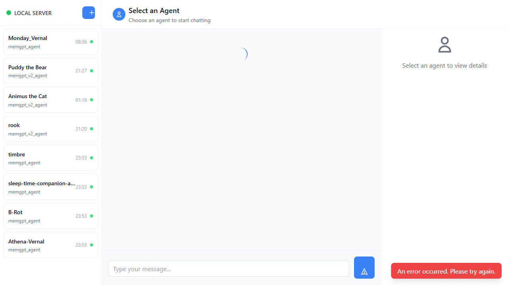

# Letta Chatbot - Flask Edition

<!--
Letta Chatbot Documentation
Copyright (C) 2025 Letta Chatbot Contributors
Licensed under CC-BY-SA 4.0
-->

A modern, full-featured Flask-based chatbot application providing an intuitive web interface for interacting with Letta AI agents. Built with Flask, HTMX, and Tailwind CSS for a responsive, real-time chat experience.



## 🌟 Features

- **Multi-Agent Support** - Create, manage, and chat with multiple AI agents simultaneously
- **Real-Time Chat** - Interactive chat interface powered by HTMX for seamless updates
- **Persistent Memory** - Agents maintain conversation history and context across sessions
- **Archival Memory** - Long-term semantic memory storage and retrieval
- **Identity Management** - Per-user conversation contexts with isolated memory blocks
- **Agent Customization** - Configure agent personas, memory blocks, and behavior
- **Responsive Design** - Mobile-first design that works beautifully on all devices
- **Dark Mode Support** - Built-in dark mode for comfortable viewing
- **Session Management** - Cookie-based user sessions for multi-user deployments
- **Performance Optimized** - Caching, rate limiting, and efficient API calls
- **Security Hardened** - XSS protection, CSRF tokens, input validation
- **Production Ready** - Comprehensive error handling and logging

## 📋 Table of Contents

- [Quick Start](#-quick-start)
- [Prerequisites](#prerequisites)
- [Installation](#installation)
- [Configuration](#configuration)
- [Usage](#usage)
- [Architecture](#-architecture)
- [API Reference](#-api-reference)
- [Development](#-development)
- [Testing](#-testing)
- [Deployment](#-deployment)
- [Contributing](#-contributing)
- [License](#-license)

## 🚀 Quick Start

### Prerequisites

- **Python 3.8+** - Modern Python with asyncio support
- **Letta Server** - Running instance of Letta server (local or cloud)
- **Git** - For cloning the repository

### Installation

1. **Clone the repository**
   ```bash
   git clone https://github.com/your-org/letta-chatbot-example.git
   cd letta-chatbot-example
   ```

2. **Create virtual environment**
   ```bash
   python -m venv venv
   
   # On Windows
   venv\Scripts\activate
   
   # On Linux/Mac
   source venv/bin/activate
   ```

3. **Install dependencies**
   ```bash
   pip install -r requirements.txt
   ```

4. **Configure environment**
   ```bash
   cp env.example .env
   ```
   
   Edit `.env` and set your configuration:
   ```env
   LETTA_BASE_URL=https://your-letta-server.com:8283
   LETTA_API_KEY=your_api_key_here
   FLASK_SECRET_KEY=your_secret_key_here
   USE_COOKIE_BASED_AUTHENTICATION=true
   ```

5. **Run the application**
   ```bash
   python wsgi.py
   ```

6. **Open in browser**
   ```
   http://localhost:5000
   ```

## ⚙️ Configuration

### Environment Variables

Create a `.env` file in the project root with the following variables:

| Variable | Description | Default | Required |
|----------|-------------|---------|----------|
| `LETTA_BASE_URL` | URL of your Letta server | `http://localhost:8283` | Yes |
| `LETTA_API_KEY` | Your Letta API authentication key | `DEFAULT_TOKEN` | Yes |
| `FLASK_SECRET_KEY` | Secret key for Flask sessions | Random | Yes (Production) |
| `USE_COOKIE_BASED_AUTHENTICATION` | Enable multi-user sessions | `true` | No |
| `CREATE_AGENTS_FROM_UI` | Allow agent creation from UI | `true` | No |
| `FLASK_ENV` | Environment mode | `development` | No |

### Default Agent Configuration

Edit `default-agent.json` to customize default agent settings:

```json
{
  "DEFAULT_MEMORY_BLOCKS": [
    {
      "label": "human",
      "value": "The human's name is [User Name]"
    },
    {
      "label": "persona",
      "value": "My name is Sam, the all-knowing sentient AI."
    }
  ],
  "DEFAULT_LLM": "letta/letta-free",
  "DEFAULT_EMBEDDING": "letta/letta-free"
}
```

### Supported LLM Models

The application supports any model available in your Letta installation:
- **Letta Cloud**: `letta/letta-free`, `letta/letta-pro`
- **OpenAI**: `gpt-4`, `gpt-3.5-turbo`
- **Anthropic**: `claude-3-opus`, `claude-3-sonnet`
- **Local Models**: Any model via Ollama, LM Studio, etc.

## 📖 Usage

### Creating an Agent

1. Click the "+" button in the sidebar
2. Agent is created with default configuration
3. Click on the agent to start chatting

### Customizing an Agent

1. Hover over an agent in the sidebar
2. Click the edit icon (pencil)
3. Modify the agent's name, system prompt, or memory blocks
4. Click "Save Changes"

### Chatting with an Agent

1. Select an agent from the sidebar
2. Type your message in the input box
3. Press Enter or click Send
4. View the agent's response in real-time

### Managing Memory

**Core Memory**: Always-loaded context (persona, human info)
- Edit via the agent edit modal
- Limited size for efficiency

**Archival Memory**: Long-term semantic storage
- View via the "Archive" button
- Search and retrieve past information
- Automatically accessed by agent

### Deleting an Agent

1. Hover over an agent in the sidebar
2. Click the options menu (three dots)
3. Select "Delete"
4. Confirm deletion

## 🏗️ Architecture

### Backend (Flask)

```
app/
├── __init__.py          # Flask application factory
├── config.py            # Configuration classes
├── routes/              # API endpoints
│   ├── agents.py        # Agent CRUD operations
│   ├── messages.py      # Message handling
│   ├── runtime.py       # Runtime configuration
│   └── frontend.py      # Page rendering
├── templates/           # Jinja2 templates
│   ├── base.html        # Base layout
│   ├── index.html       # Main chat page
│   └── components/      # Reusable components
├── utils/               # Utility modules
│   ├── letta_client.py  # Letta API wrapper
│   ├── session_manager.py # User session handling
│   ├── validators.py    # Message filtering
│   ├── error_handler.py # Error handling
│   └── performance.py   # Caching & rate limiting
└── static/              # Static assets
```

### Frontend (HTMX + Tailwind)

- **HTMX**: Handles real-time updates without full page reloads
- **Tailwind CSS**: Utility-first styling with dark mode support
- **Alpine.js**: Lightweight JavaScript for interactivity
- **Server-Side Rendering**: Fast initial load, SEO-friendly

### Key Design Decisions

1. **HTMX over React**: Simpler architecture, less JavaScript
2. **Cookie-based sessions**: Stateless authentication for multi-user
3. **Component-based templates**: Reusable, maintainable UI
4. **Error boundaries**: Graceful degradation on failures
5. **Rate limiting**: Prevent abuse and API overload

## 🔌 API Reference

See [docs/API.md](docs/API.md) for complete API documentation.

### Quick Reference

| Endpoint | Method | Description |
|----------|--------|-------------|
| `/` | GET | Main chat interface |
| `/<agent_id>` | GET | Chat with specific agent |
| `/api/agents` | GET | List user's agents |
| `/api/agents` | POST | Create new agent |
| `/api/agents/<id>` | GET | Get agent details |
| `/api/agents/<id>` | PUT | Update agent |
| `/api/agents/<id>` | DELETE | Delete agent |
| `/api/agents/<id>/messages` | GET | Get agent messages |
| `/api/agents/<id>/messages` | POST | Send message |
| `/api/runtime` | GET | Get configuration |

## 🛠️ Development

### Project Setup

```bash
# Install development dependencies
pip install -r requirements.txt

# Run in development mode
export FLASK_ENV=development
python wsgi.py
```

### Code Structure

- **Blueprints**: Organized into logical route groups
- **Factory Pattern**: Application created via `create_app()`
- **Dependency Injection**: Configuration passed to blueprints
- **Error Handling**: Centralized error handlers
- **Logging**: Comprehensive logging throughout

### Adding a New Route

1. Create route function in appropriate blueprint
2. Add route decorator with path and methods
3. Implement business logic
4. Return JSON or rendered template
5. Add error handling

Example:
```python
@agents_bp.route('/agents/<agent_id>/archive', methods=['GET'])
@handle_api_error
def get_agent_archive(agent_id):
    client = LettaClient()
    archive = client.get_archival_memory(agent_id)
    return jsonify(archive)
```

### Adding a New Component

1. Create template in `app/templates/components/`
2. Include component in parent template
3. Add HTMX attributes for interactivity
4. Style with Tailwind classes

## 🧪 Testing

### Running Tests

```bash
# Run all tests
python run_tests.py --mode all

# Run quick tests (unit only)
python run_tests.py --mode quick

# Run specific test suites
python run_tests.py --mode unit
python run_tests.py --mode integration
python run_tests.py --mode e2e

# Run tests in parallel
python run_tests.py --mode parallel

# Generate coverage report
python run_tests.py --mode all
# View htmlcov/index.html
```

### Test Categories

- **Unit Tests**: Test individual functions and classes
- **Integration Tests**: Test component interactions
- **E2E Tests**: Test full user workflows
- **Performance Tests**: Test speed and efficiency
- **Security Tests**: Test for vulnerabilities

### Writing Tests

```python
import pytest
from app import create_app

@pytest.fixture
def client():
    app = create_app('testing')
    with app.test_client() as client:
        yield client

def test_create_agent(client):
    response = client.post('/api/agents', json={
        'name': 'Test Agent'
    })
    assert response.status_code == 200
```

## 🚢 Deployment

See [docs/DEPLOYMENT.md](docs/DEPLOYMENT.md) for detailed deployment instructions.

### Quick Deployment (Production)

```bash
# Set production environment
export FLASK_ENV=production
export FLASK_SECRET_KEY="your-secure-secret-key"

# Run with Gunicorn
gunicorn -w 4 -b 0.0.0.0:5000 wsgi_production:app

# Or with uWSGI
uwsgi --http :5000 --wsgi-file wsgi_production.py --callable app
```

### Docker Deployment

```bash
# Build image
docker build -t letta-chatbot .

# Run container
docker run -d -p 5000:5000 \
  -e LETTA_BASE_URL="https://your-server.com:8283" \
  -e LETTA_API_KEY="your_key" \
  letta-chatbot
```

### Reverse Proxy (Nginx)

```nginx
server {
    listen 80;
    server_name your-domain.com;

    location / {
        proxy_pass http://127.0.0.1:5000;
        proxy_set_header Host $host;
        proxy_set_header X-Real-IP $remote_addr;
    }
}
```

## 🤝 Contributing

We welcome contributions! See [CONTRIBUTING.md](CONTRIBUTING.md) for guidelines.

### Quick Contribution Guide

1. Fork the repository
2. Create a feature branch (`git checkout -b feature/amazing-feature`)
3. Make your changes
4. Add tests for new functionality
5. Run tests (`python run_tests.py --mode all`)
6. Commit your changes (`git commit -m 'Add amazing feature'`)
7. Push to the branch (`git push origin feature/amazing-feature`)
8. Open a Pull Request

### Code Style

- Follow PEP 8 for Python code
- Use Black for code formatting
- Write docstrings for all functions
- Add type hints where appropriate
- Keep functions small and focused

## 📄 License

This project is dual-licensed:

- **Code (Python, JavaScript, etc.)**: [GNU Affero General Public License v3.0](LICENSE)
- **Documentation (Markdown, text files, etc.)**: [Creative Commons Attribution-ShareAlike 4.0](LICENSE-DOCUMENTATION)

Copyright (C) 2025 Letta Chatbot Contributors

## 🙏 Acknowledgments

- [Letta AI](https://letta.ai) - For the amazing AI agent framework
- [Flask](https://flask.palletsprojects.com/) - The web framework
- [HTMX](https://htmx.org/) - For making interactive web apps simple
- [Tailwind CSS](https://tailwindcss.com/) - For beautiful styling
- All contributors and users of this project

## 📞 Support

- **Documentation**: [docs/](docs/)
- **Issues**: [GitHub Issues](https://github.com/your-org/letta-chatbot-example/issues)
- **Discussions**: [GitHub Discussions](https://github.com/your-org/letta-chatbot-example/discussions)
- **Letta Discord**: [Join the community](https://discord.gg/letta)

## 🗺️ Roadmap

- [ ] WebSocket support for real-time streaming
- [ ] File upload and document chat
- [ ] Multi-modal support (images, audio)
- [ ] Agent templates and presets
- [ ] Conversation export/import
- [ ] Team collaboration features
- [ ] Advanced analytics dashboard
- [ ] Plugin system for extensions

---

**Built with ❤️ by the Letta community**

